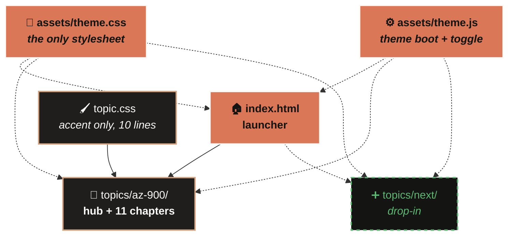
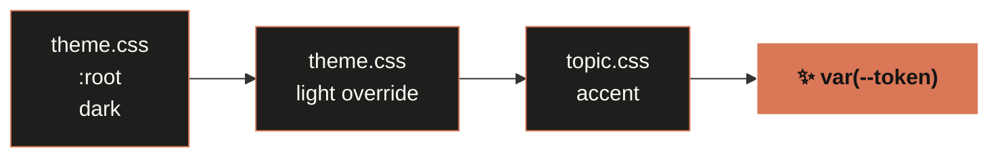
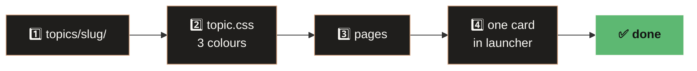

<div align="center">

# 🎓 Debanjan's Learning System

**One theme at the root. Infinite topics underneath.**
Offline-first certification notes. No build, no server, no network.


</div>

---

## ⚡ Run it

```bash
start index.html          # Windows
open  index.html          # macOS / Linux
```

That's it. Double-clicking the file also works.

---

## 🏗️ Architecture

Presentation flows **down**. Nothing flows up. A new topic costs one folder + one card.



```text
📁 index.html          launcher
📁 assets/             theme.css · theme.js      ← all presentation
📁 docs/               THEME.md · NEW-TOPIC.md
📁 topics/az-900/      topic.css + 12 pages      ← content only
```

---

## 🎨 Palette

Colour literals live **only** in the two `:root` blocks. Everything else uses `var(--token)`.

| | Token | Dark | Light | |
|:--|:--|:--|:--|:--|
|  | `--bg` | `#141413` | `#faf9f5` |  |
|  | `--surface` | `#1f1e1c` | `#ffffff` |  |
|  | `--accent` | `#d97757` | `#b3552d` |  |
|  | `--good` | `#5db872` | `#2f7a44` |  |
|  | `--warn` | `#d4a017` | `#8a6100` |  |

<details>
<summary><b>+8 more tokens</b></summary>

`--surface-2` `--border` `--text` `--muted` `--accent-soft` `--accent-dim` `--row` `--code`
Non-colour: `--radius` `8px` · `--maxw` `72rem` · `--font` · `--font-serif` · `--mono`

</details>

---

## 🌗 Theming



`theme.js` runs in `<head>` **before** the stylesheets, with no `defer` — it sets `data-theme` pre-paint, so a saved light theme never flashes dark. Key: `dls-theme`.

> [!NOTE]
> `localStorage` over `file://` is browser-policy dependent. The toggle always works on the current page; persistence across navigation is not guaranteed. Blocked storage falls back to dark, silently.

---

## 📄 Page contract

Three lines replaced a 107-line inline stylesheet:

```html
<script src="../../assets/theme.js"></script>
<link rel="stylesheet" href="../../assets/theme.css">
<link rel="stylesheet" href="topic.css">
```

🔒 Script first → no flash · `topic.css` last → accent wins · `../../` never `/` → `file://` safe

---

## ➕ Add a topic



Platform files stay untouched. A topic's entire identity is ten lines:

```css
:root { --accent: #d97757; --accent-soft: #d4a27f; --accent-dim: rgba(217,119,87,.10); }
:root[data-theme="light"] { --accent: #b3552d; --accent-soft: #8a4522; --accent-dim: rgba(179,85,45,.08); }
```

📖 [`docs/NEW-TOPIC.md`](docs/NEW-TOPIC.md) · [`docs/THEME.md`](docs/THEME.md)

---

## 📚 Topics

###  · 12 pages

<details>
<summary><b>11 chapters, mapped to exam domains</b></summary>

| # | Chapter | Domain |
|:--|:--|:--|
| 01 | Cloud computing | ☁️ Concepts · 25-30% |
| 02 | Benefits of cloud services | ☁️ Concepts · 25-30% |
| 03 | Cloud service types | ☁️ Concepts · 25-30% |
| 04 | Core architectural components | 🏛️ Architecture · 35-40% |
| 05 | Compute and networking | 🏛️ Architecture · 35-40% |
| 06 | Storage services | 🏛️ Architecture · 35-40% |
| 07 | Identity, access, security | 🏛️ Architecture · 35-40% |
| 08 | Cost management | 🛡️ Governance · 30-35% |
| 09 | Governance and compliance | 🛡️ Governance · 30-35% |
| 10 | Managing and deploying resources | 🛡️ Governance · 30-35% |
| 11 | Monitoring tools | 🛡️ Governance · 30-35% |

Each page ships diagrams, comparison tables, confusion callouts, MCQs and active recall. The hub adds a live filter and a cross-chapter confusion index.

</details>

---

## 📐 Rules

| ❌ Never | 💥 Because |
|:--|:--|
| Build step or server | Must open years from now, toolchain-free |
| Remote asset or web font | Works with the network off |
| Non-ASCII byte in markup | Mojibake under `file://` — use `&mdash;` `&middot;` |
| `/assets/...` path | Resolves to filesystem root under `file://` |
| Colour outside `:root` | Would break one of the two themes |
| CSS inside a page | The exact problem this repo killed |

---

## 📊 Impact

<div align="center">

| | Before | After |
|:--|:--:|:--:|
| Stylesheet copies | `12` | **`1`** |
| Page weight | `399 KB` | **`303 KB`** |
| Files to change a colour | `12` | **`1`** |
| Inline theme scripts | `13` | **`0`** |
| Topics supported | `1` hardcoded | **`N`** drop-in |

</div>

<details>
<summary><b>🔍 Verification</b> — all static checks passed</summary>

`<style>` tags: **0** · retired `az900-theme` key: **0** · asset refs correct: **36/36** · `defer`/`async`: **0** · missing selectors: **0** · dead links or anchors: **0** · non-ASCII bytes: **0** · remote assets: **0** · toggle hooks: **13/13** · source folder modified: **no**

Needs a human eye: rendered dark/light appearance, and whether the theme sticks across pages in your browser.

</details>

---

## ♻️ Rollback

The original flat folder was **copied, never moved**. It sits outside this repo, unmodified.

`git restore <path>` → one file · `git revert <sha>` → one commit · recopy → everything

---

<div align="center">

**Built to still work in ten years.**
No framework · no bundler · no CDN · no lock file

</div>
