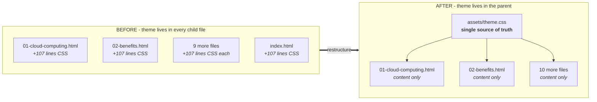
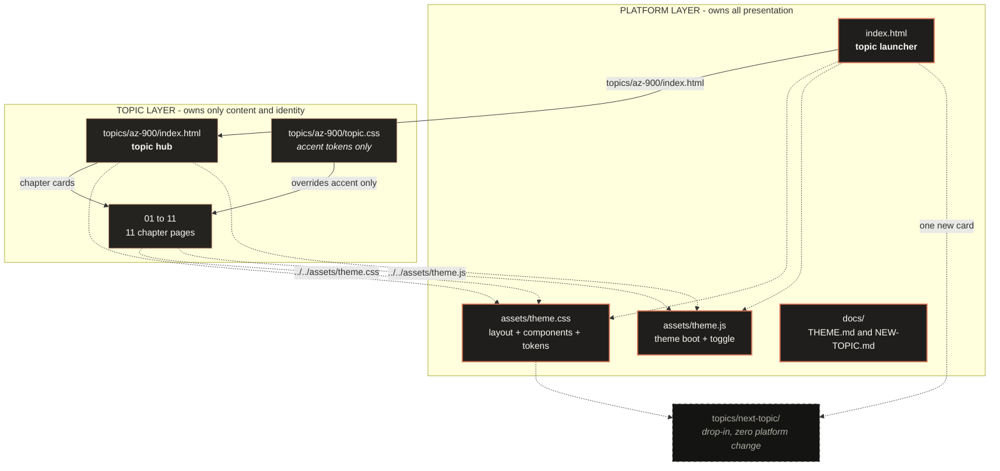
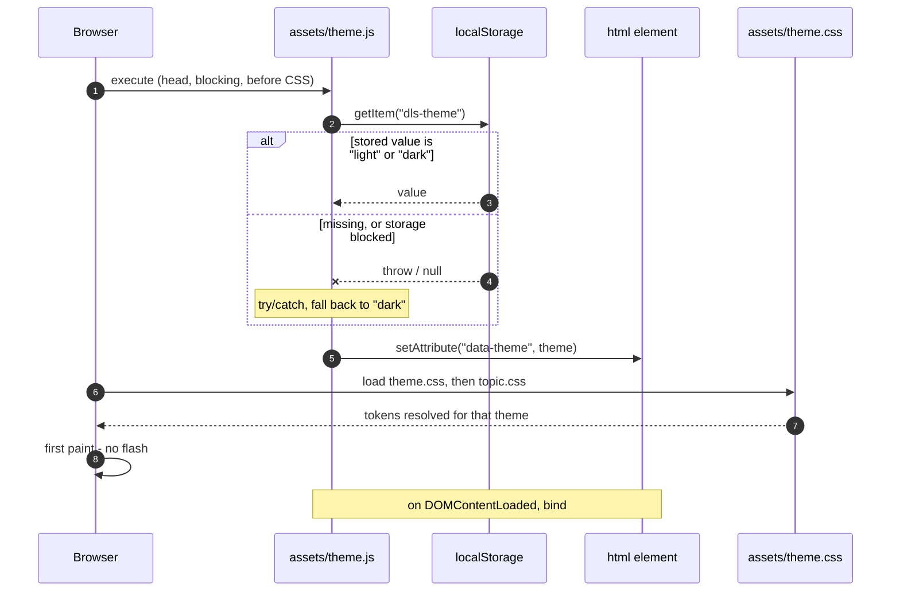
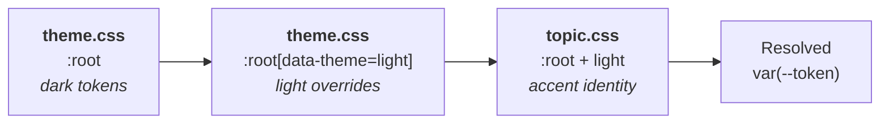
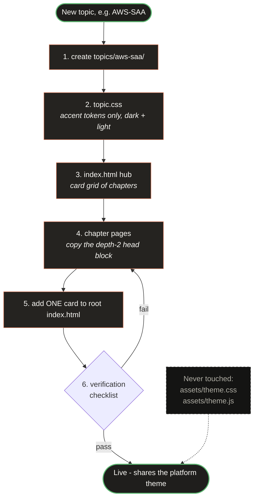
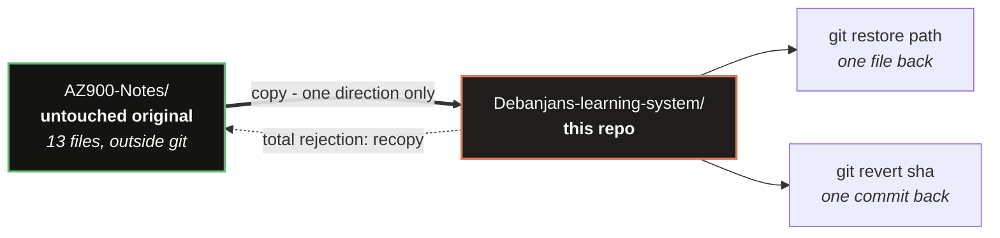

<div align="center">

# Debanjan's Learning System

**A zero-dependency, offline-first study platform for certification notes.**

One shared theme at the root. Many self-contained topics underneath. No build step, no server, no network.

[](#quick-start)
[](#quick-start)
[](#anatomy-of-a-page)
[](#how-theming-works)
[](#design-constraints)
[](#topics)

</div>

---

## Table of contents

| Section | What it covers |
| --- | --- |
| [Why this exists](#why-this-exists) | The duplication problem this repo solves |
| [Quick start](#quick-start) | Open it in ten seconds |
| [Architecture](#architecture) | How the platform and topics relate |
| [Repository layout](#repository-layout) | Every file and who owns it |
| [How theming works](#how-theming-works) | Boot sequence, cascade, token contract |
| [Design tokens](#design-tokens) | Full dark and light palette |
| [Anatomy of a page](#anatomy-of-a-page) | The exact contract every page follows |
| [Adding a new topic](#adding-a-new-topic) | Step-by-step, with flowchart |
| [Topics](#topics) | What is currently in here |
| [Design constraints](#design-constraints) | The rules that keep it portable |
| [Verification](#verification) | How correctness was proven |
| [Migration record](#migration-record) | Before and after, with numbers |
| [Rollback](#rollback) | The safety net |

---

## Why this exists

The notes started life as a flat folder of standalone HTML files. Every page carried its own **inline copy of the same 107-line stylesheet** plus its own theme-toggle script. Changing one accent colour meant editing twelve files and hoping none of them drifted.



**Result:** 12 copies collapsed to 1. One edit now repaints every page of every topic.

---

## Quick start

No install, no `npm`, no local server.

```powershell
# Windows
start .\index.html
```

```bash
# macOS / Linux
open ./index.html      # or: xdg-open ./index.html
```

Or paste the path straight into a browser:

```text
file:///C:/K4U/Debanjans-learning-system/index.html
```

The launcher lists every topic. Pick one, read, use `Prev` / `Next` to walk chapters, and hit the toggle in the top bar to switch dark and light.

---

## Architecture

Two layers with a hard boundary. The **platform** owns everything visual. A **topic** owns nothing but its content and its accent colour.



**The boundary rule:** presentation flows *down* from the platform. Nothing flows *up* from a topic. That is what makes a second topic cost one folder and one card.

---

## Repository layout

```text
Debanjans-learning-system/
│
├── index.html                     ← topic launcher · lists all topics
├── .gitignore
│
├── assets/                        ← PLATFORM · shared by every page
│   ├── theme.css                  ← 107 lines · the only stylesheet
│   └── theme.js                   ← theme boot + toggle · key: dls-theme
│
├── docs/
│   ├── THEME.md                   ← platform spec · topic-agnostic
│   └── NEW-TOPIC.md               ← runbook · add a topic
│
└── topics/
    └── az-900/                    ← TOPIC · Azure Fundamentals
        ├── topic.css              ← accent tokens ONLY (10 lines)
        ├── index.html             ← topic hub · card grid + filter
        ├── 01-cloud-computing.html
        ├── 02-benefits.html
        ├── 03-service-types.html
        ├── 04-core-architecture.html
        ├── 05-compute-networking.html
        ├── 06-storage.html
        ├── 07-identity-security.html
        ├── 08-cost-management.html
        ├── 09-governance-compliance.html
        ├── 10-management-deployment.html
        └── 11-monitoring.html
```

### Ownership matrix

| File | Owns | Must **never** contain |
| --- | --- | --- |
| `assets/theme.css` | Reset, layout, components, both `:root` token blocks, media queries | Topic names, page-specific selectors, `@font-face`, remote URLs |
| `assets/theme.js` | Pre-paint theme restore, toggle binding, persistence | Any topic logic, any network call |
| `topics/*/topic.css` | `--accent`, `--accent-soft`, `--accent-dim` for dark + light | Layout, components, media queries, anything non-colour |
| `topics/*/*.html` | Notes, tables, inline SVG diagrams, anchors | `<style>` blocks, inline theme JS, colour literals |
| `index.html` | Platform identity, one card per topic | Chapter lists, topic-specific footer scope |

---

## How theming works

Three mechanisms, deliberately boring: a CSS custom-property cascade, one `data-theme` attribute, one `localStorage` key.

### Boot sequence

The theme script is a **plain `<head>` script with no `defer`, placed before the stylesheet links**. That ordering is load-bearing: it sets `data-theme` before the browser paints, so a saved light theme never flashes dark.



### Cascade order

Later wins. `topic.css` is loaded last on purpose, so a topic can restyle its identity without touching the platform.



### Toggle contract

`theme.js` requires exactly two hooks in the markup. Both are present in all 13 HTML files:

| Hook | Purpose |
| --- | --- |
| `id="theme-toggle"` | The button the click handler binds to |
| `.theme-label` | The text node synced to `Dark` / `Light` |

> [!NOTE]
> **Persistence caveat.** `localStorage` behaviour for documents loaded over `file://` is browser-policy dependent and not guaranteed by spec. The toggle always works for the current page. Whether the choice survives navigation depends on your browser. All storage access is wrapped in `try/catch`, so a blocked store degrades silently to the dark default rather than throwing.

---

## Design tokens

Every colour in the system resolves through these. Colour literals are permitted **only** inside the two `:root` blocks in `theme.css` and the accent overrides in `topic.css` — nowhere else, including inline SVG, which must paint with `currentColor` or `var(--token)`.

| Token | Dark | Light | Role |
| --- | --- | --- | --- |
| `--bg` | `#141413` | `#faf9f5` | Page background |
| `--surface` | `#1f1e1c` | `#ffffff` | Cards, sticky top bar |
| `--surface-2` | `#252320` | `#f2f0e8` | Nested cards, table headers |
| `--border` | `#3d3d3a` | `#d9d5c8` | All hairlines |
| `--text` | `#faf9f5` | `#141413` | Body copy |
| `--muted` | `#b0aea5` | `#605e57` | Secondary copy, kickers |
| `--accent` | `#d97757` | `#b3552d` | Links, rules, active state |
| `--accent-soft` | `#d4a27f` | `#8a4522` | Callout labels |
| `--accent-dim` | `rgba(217,119,87,.10)` | `rgba(179,85,45,.08)` | Callout fills |
| `--good` | `#5db872` | `#2f7a44` | Positive callouts |
| `--warn` | `#d4a017` | `#8a6100` | Caution callouts |
| `--row` | `rgba(250,249,245,.035)` | `rgba(20,20,19,.035)` | Table zebra striping |
| `--code` | `#1f1e1b` | `#f4f2ea` | Code and input fields |

Non-colour tokens: `--radius` `8px` · `--maxw` `72rem` · `--font` · `--font-serif` · `--mono`.

> Styrene and Tiempos are commercial faces and are **named first, then fall back** to system and open substitutes. No `@font-face`, no downloaded font, no remote request.

---

## Anatomy of a page

Every topic page opens with exactly this. Three lines replaced a 107-line inline stylesheet.

```html
<!doctype html>
<html lang="en" data-theme="dark">
<head>
<meta charset="utf-8">
<meta name="viewport" content="width=device-width, initial-scale=1">
<title>Describe cloud computing &middot; AZ-900 Notes</title>
<script src="../../assets/theme.js"></script>
<link rel="stylesheet" href="../../assets/theme.css">
<link rel="stylesheet" href="topic.css">
</head>
```

Why this exact order:

| Rule | Reason |
| --- | --- |
| `charset` first | Encoding settled before any content is parsed |
| Script **before** the links | `data-theme` is set before paint — no theme flash |
| **No** `defer` / `async` | Deferred execution would paint the wrong theme first |
| `theme.css` **before** `topic.css` | Topic accent must win the cascade |
| `../../` relative, never `/assets/` | A root-relative path resolves to the filesystem root under `file://` and breaks |

### Component vocabulary

Pages compose from a fixed set of platform classes. No page invents CSS.

| Class | Component |
| --- | --- |
| `.top` `.top-inner` `.site` `.top-links` | Sticky navigation bar |
| `header.head` `h1` `.kicker` `.pills` `.pill` | Page masthead |
| `nav.toc` | Anchor pill row |
| `section.card` | Content section |
| `.grid` + `.grid > .card` | Responsive card grid |
| `dl.defs` | Two-column definition list |
| `.tw` + `table.t` | Horizontally scrollable table |
| `.cal` `.cal.confuse` `.cal.clue` `.cal.hook` | Callouts: default, caution, positive, hook |
| `details.more` | Collapsible aside |
| `.icon` `.card-icon` | Inline `em`-scaled SVG icons |
| `.foot` | Page footer |

---

## Adding a new topic

Cost of a second topic: **one folder plus one card.** Zero platform files change.



A complete `topic.css` is ten lines. This is the entire visual identity of a topic:

```css
/* This file is the ONLY place a topic may set colour. */
:root {
  --accent: #d97757;
  --accent-soft: #d4a27f;
  --accent-dim: rgba(217, 119, 87, .10);
}
:root[data-theme="light"] {
  --accent: #b3552d;
  --accent-soft: #8a4522;
  --accent-dim: rgba(179, 85, 45, .08);
}
```

Full runbook with copy-paste blocks: **[`docs/NEW-TOPIC.md`](docs/NEW-TOPIC.md)**. Platform contract: **[`docs/THEME.md`](docs/THEME.md)**.

---

## Topics

### AZ-900 · Microsoft Azure Fundamentals

12 pages — a hub plus 11 chapters, mapped to the official exam domains.

| # | Chapter | Domain | Weight |
| --- | --- | --- | --- |
| 01 | Describe cloud computing | Cloud concepts | 25&ndash;30% |
| 02 | Describe the benefits of using cloud services | Cloud concepts | 25&ndash;30% |
| 03 | Describe cloud service types | Cloud concepts | 25&ndash;30% |
| 04 | Describe the core architectural components of Azure | Azure architecture &amp; services | 35&ndash;40% |
| 05 | Describe Azure compute and networking services | Azure architecture &amp; services | 35&ndash;40% |
| 06 | Describe Azure storage services | Azure architecture &amp; services | 35&ndash;40% |
| 07 | Describe Azure identity, access, and security | Azure architecture &amp; services | 35&ndash;40% |
| 08 | Describe cost management in Azure | Management &amp; governance | 30&ndash;35% |
| 09 | Describe governance and compliance features and tools | Management &amp; governance | 30&ndash;35% |
| 10 | Describe features and tools for managing and deploying resources | Management &amp; governance | 30&ndash;35% |
| 11 | Describe monitoring tools in Azure | Management &amp; governance | 30&ndash;35% |

Each chapter carries a skills-measured list, inline SVG diagrams, comparison tables, confusion callouts, an MCQ set (`#mcq`) and an active-recall section (`#recall`). The hub adds a live text filter over the chapter cards and a cross-chapter confusion index.

---

## Design constraints

These are not preferences. Each one exists because breaking it breaks offline use.

| Constraint | Failure it prevents |
| --- | --- |
| **No build step** | Notes must open years from now with no toolchain |
| **No server** | Everything works from `file://`, off a USB stick |
| **No remote assets** | No CDN, no web font, no analytics — works with the network off |
| **ASCII-only markup** | Non-ASCII bytes cause mojibake in `file://` documents; use `&mdash;` `&middot;` `&rsquo;` `&larr;` `&rarr;` |
| **Relative paths only** | `/assets/...` resolves to the filesystem root under `file://` and 404s |
| **Colour literals only in `:root`** | Guarantees both themes stay complete and switchable |
| **SVG paints `currentColor` / `var(--token)`** | Diagrams follow the theme instead of fighting it |
| **CSS never duplicated into a page** | The problem this repo was built to eliminate |

> Badges and Mermaid diagrams in this README are rendered by GitHub. The no-remote-asset rule applies to the **site pages**, which contain zero external references.

---

## Verification

The restructure was proven statically before commit. Every item below was checked against the files on disk.

| Check | Result |
| --- | --- |
| `<style>` tags across 13 HTML files | **0** |
| Occurrences of the retired `az900-theme` key | **0** |
| Asset references, all correct depth and order | **36** (3 × 12 pages) |
| Scripts using `defer` / `async` | **0** |
| Selectors from the original block missing in `theme.css` | **0** |
| Dead local links or unresolved `#anchor`s | **0** |
| Raw non-ASCII bytes in any HTML/CSS/JS/MD | **0** |
| `@font-face`, remote `src`, root-relative asset paths | **0** |
| Files with both `#theme-toggle` and `.theme-label` | **13 / 13** |
| Source folder modified | **No** — original timestamps intact |

### Manual pass

Static analysis cannot click. Confirm by hand:

- [ ] Launcher renders dark, AZ-900 card opens the hub
- [ ] Toggle flips dark ↔ light; label and icon follow
- [ ] Light theme holds across tables, callouts, code and SVG diagrams
- [ ] `Prev` / `Next` walks 01 → 11 and returns to the hub
- [ ] `Home` returns to the launcher from any chapter
- [ ] Every TOC pill jumps to its heading, clear of the sticky bar
- [ ] Hub filter narrows the chapter cards as you type

---

## Migration record

| Metric | Before | After |
| --- | --- | --- |
| Copies of the stylesheet | 12 inline | **1 shared** |
| Total topic-page weight | 399 KB | **303 KB** (&minus;96 KB) |
| Files to edit to change the accent | 12 | **1** |
| Inline theme scripts | 13 | **0** |
| Storage key | `az900-theme` | `dls-theme` (platform-wide) |
| Topics supported | 1, hardcoded | **N**, drop-in |
| Structure | flat folder | platform + topic layers |

Commit history:

| Commit | Change |
| --- | --- |
| `b80373e` | Generalize AZ-900 notes into Debanjan's Learning System |
| `32ecefb` | Drop redundant self-referencing Home link from launcher top bar |

---

## Rollback

The original flat folder was **copied, never moved**. It sits outside this repository, unmodified, as an independent safety net.



| Scope | Action |
| --- | --- |
| One file | `git restore <path>` |
| One commit | `git revert <sha>` |
| Everything | Recopy from the original folder — it was never written to |

---

<div align="center">

**Built to still work in ten years.** No framework, no bundler, no CDN, no lock file.

</div>
