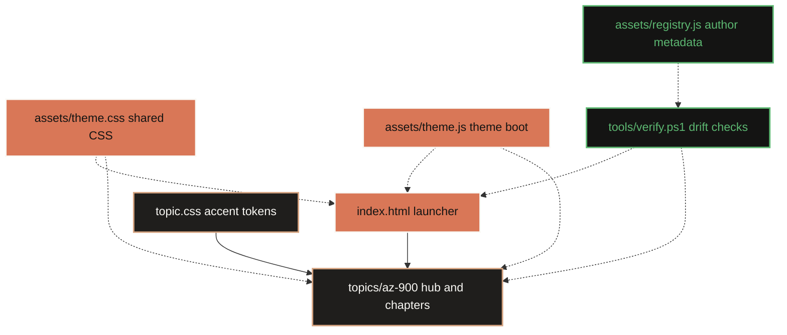
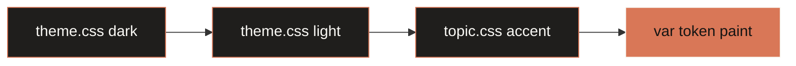
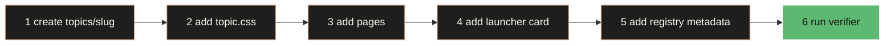

<div align="center">

# 🎓 Debanjan's Learning System

**One theme at root. Infinite topics underneath.**  
Offline-first certification notes. No build, no server, no network.


</div>

---

## ⚡ Run it

```bash
start index.html          # Windows
open  index.html          # macOS / Linux
```

Double-clicking `index.html` works too.

---

## 🏗️ Architecture

Presentation flows down. Metadata validates from the side. Pages stay readable without JavaScript.



```text
index.html          launcher
assets/             theme.css, theme.js, registry.js
content             topics/az-900/topic.css plus 14 pages
tools/              verify.ps1
```

---

## 🎨 Palette

Colour literals live in root token blocks. Components consume `var(--token)`.

| | Token | Dark | Light | |
|:--|:--|:--|:--|:--|
|  | `--bg` | `#141413` | `#faf9f5` |  |
|  | `--surface` | `#1f1e1c` | `#ffffff` |  |
|  | `--accent` | `#d97757` | `#b3552d` |  |
|  | `--good` | `#5db872` | `#2f7a44` |  |
|  | `--warn` | `#d4a017` | `#8a6100` |  |

<details>
<summary><b>More tokens</b></summary>

`--surface-2` `--border` `--text` `--muted` `--accent-soft` `--accent-dim` `--good-dim` `--warn-dim` `--hook-dim` `--row` `--code`  
Non-colour: `--radius` `--maxw` `--sticky` `--font` `--font-serif` `--mono`

</details>

---

## 🌗 Theming



`theme.js` runs in `<head>` before stylesheets. It sets `data-theme` before paint, reads only `dls-theme`, and syncs the toggle label plus `aria-pressed`.

> [!NOTE]
> `localStorage` is scoped by file URL. Theme choice will often **not persist across pages** opened directly from `file://`; current-page toggle still works. Blocked storage falls back to dark.

Paper-first print mode switches to white backgrounds, readable dark text, print-safe borders, visible underlined links, and hidden navigation controls. Reduced-motion users get instant anchor scrolling.

---

## ♿ Accessibility and static rules

- Skip link is first body child and targets `<main id="main">`.
- `:focus-visible` gives keyboard users a visible accent outline.
- Filter has a real label, live match status, and visible empty state.
- Table header cells use `scope="col"`; informative diagrams use `role="img"` plus `aria-label`.
- Prose measure is capped; links are underlined instead of colour-only.
- No remote assets, build step, server, or dependencies. Scripts use ES2026 syntax in classic `<script>` tags only: no modules and no `fetch()`.
- Source markup remains ASCII-only. Mermaid fences below use ASCII only.

---

## ➕ Add a topic



Platform CSS and JavaScript stay shared. One intentional manual platform edit remains: add topic card to root launcher. `assets/registry.js` is author-side single source of truth; readers never need to load it.

```css
:root { --accent: #d97757; --accent-soft: #d4a27f; --accent-dim: rgba(217,119,87,.10); }
:root[data-theme="light"] { --accent: #b3552d; --accent-soft: #8a4522; --accent-dim: rgba(179,85,45,.08); }
```

📖 [`docs/NEW-TOPIC.md`](docs/NEW-TOPIC.md) · [`docs/THEME.md`](docs/THEME.md)

---

## Learning method

- **Attempt before reveal:** answer each recall item or MCQ before opening its explanation.
- **Calibrate:** record confidence before self-grading; compare confidence with the result to expose overconfidence and underconfidence.
- **Leitner spacing:** move successful items through 1, 3, 7, 14, and 30-day review intervals; return misses to the first box.
- **Interleave discrimination:** after chapter foundations, mix look-alike services across chapters so retrieval depends on the discriminator, not position.
- **Weight-aware priority:** review Domain 2 first, then Domain 3, then Domain 1; within each, work low-confidence, missed, and due items first.
- **Rule boundaries:** TL;DR cards state a decision rule with its boundary; misconception callouts close wrong inferences; causal steps appear only when a real ordered path exists.
- **Targeted practice:** first-use glossary links support quick definitions, and recall objectives make weakness reporting objective-level.
- **Portable study brief:** optional study.js enhancement ranks weak objectives by miss rate and marks high-confidence misses for LLM-targeted practice. Use visible textarea under `file://`; clipboard can fail, and localStorage is per file URL on disk but shared on hosted pages.

## Blueprint

Seven registry layers keep content, practice, and validation aligned:

1. Certification manifest
2. Objective registry
3. Ordered chapter map
4. Section archetypes
5. Question schema and count contract
6. Diagram catalogue and geometry rules
7. Confusion sets and hub targets

Study policy overlays those layers with Leitner, confidence, and domain-weight guidance. See [`docs/BLUEPRINT.md`](docs/BLUEPRINT.md) for data boundaries and extension steps.

---

## 📚 Topics

###  · 14 pages

<details>
<summary><b>11 chapters, mapped to exam domains</b></summary>

| # | Chapter | Domain |
|:--|:--|:--|
| 01 | Cloud computing | Concepts · 25-30% |
| 02 | Benefits of cloud services | Concepts · 25-30% |
| 03 | Cloud service types | Concepts · 25-30% |
| 04 | Core architectural components | Architecture · 35-40% |
| 05 | Compute and networking | Architecture · 35-40% |
| 06 | Storage services | Architecture · 35-40% |
| 07 | Identity, access, security | Architecture · 35-40% |
| 08 | Cost management | Governance · 30-35% |
| 09 | Governance and compliance | Governance · 30-35% |
| 10 | Managing and deploying resources | Governance · 30-35% |
| 11 | Monitoring tools | Governance · 30-35% |

Each page ships diagrams, comparison tables, callouts, MCQs, and active recall. Hub adds live filtering and confusion index.

</details>

---

## 📐 Guardrails

| Never | Because |
|:--|:--|
| Build step or server | Notes must open years from now |
| Remote asset or web font | Works with network off |
| Non-ASCII markup byte | Use HTML entities for punctuation |
| `/assets/...` path | Fails under direct `file://` opening |
| Colour outside token blocks | Breaks theme ownership |
| CSS inside page | Shared theme stays one source |
| Runtime registry dependency | Readers must not need JavaScript |

---

## 📊 Impact

<div align="center">

| | Before | After |
|:--|:--:|:--:|
| Stylesheet copies | `12` | **`1`** |
| Inline theme scripts | `13` | **`0`** |
| Topics supported | `1 hardcoded` | **`N` drop-in** |
| Drift checks | `manual` | **`tools/verify.ps1`** |
| Accessibility shell | `partial` | **skip, focus, labels, roles** |

</div>

<details>
<summary><b>🔍 Verification</b> — static checks
</summary>

`tools/verify.ps1` parses registry text without Node. It checks chapter parity, Prev/Next chain, launcher and hub targets, same-file anchors, skip/main contract, shared assets, remote assets, style tags, retired keys, root-relative paths, and non-ASCII HTML bytes. It exits non-zero on any failure.

Needs a human eye: rendered dark/light appearance and browser-specific persistence across standalone file URLs.

</details>

---

## ♻️ Rollback

Original flat folder was copied, never moved. It sits outside repo, unmodified.

`git restore <path>` restores one file · `git revert <sha>` reverts one commit · recopy restores everything

---

<div align="center">

**Built to still work in ten years.**  
No framework · no bundler · no CDN · no lock file

</div>

## Kiro authoring guidance

These runbooks guide future topic authoring:

| Runbook | Purpose |
|:--|:--|
| `/add-topic` | Add topic structure and metadata |
| `/author-page` | Author accessible offline pages |
| `/author-diagram` | Author labelled diagrams |
| `/author-questions` | Author study questions |
| `/verify-system` | Run repository checks |
| `.kiro/steering/learning-system.md` | Always-loaded hard invariants |

Skills load on demand; steering stays in context. See `.kiro/skills/` and `.kiro/steering/`.